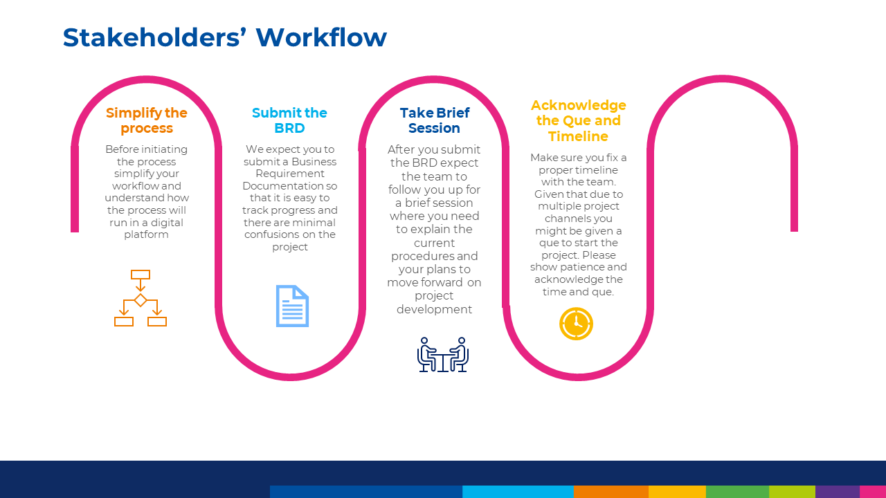
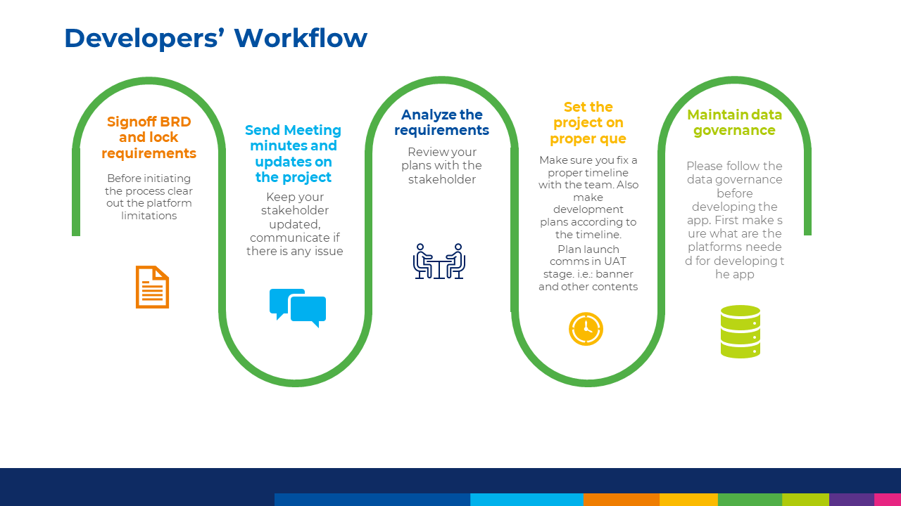
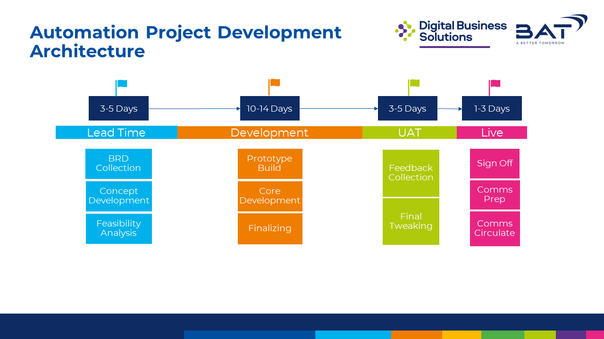

# BATB Automation desk data and project governance   
N.B: The data governance regulation has been set based on the data collected from public survey acting as the justification of the regulations. Find the excel file(BATB DBS Automation Desk Data Governance Test Feedback) in this repository to see the detailed data.  
<h1>General Governance</h1> 
1. Brief and maintain the user workflow with users: 
 
2. The workflow for developers is as below: 
 
3. The approximate project timeline is predicted to be as below:  
 
<h1>PowerApps Data source</h1> 
1. Excel is not recommended to use as a data source because of it's sharing issue. Justification: Excel data can only be shared within BAT environment but the sharing modality works only in individual links. that means anyone without the link can not access or need to hit the link at least once which is not feasible.  
2. Use SharePoint list as data source. Justification: SharePoint can be shared with everyone in BAT modality. This is very convenient to use and there are no issues with access.  
3.SharePoint list settings for best outcome is as below:  
a. Settings > b. Site Permissions > c. Advanced permissions Settings >  
d. If Some content on this site has different permissions from what you see here.  Show these items.  
or continue to   
e. Grant Permissions> f. Everyone except external users  
g. Select members , visitors and users > h. edit user permissions > i. Contribute > j. select ok   
 
4. Adding this seting will block users to make changes to sharepoint list. But keep in note that this will still allow item level permissions. That means user can edit / delete their/others data.  
 <h1>PowerApps</h1> 
1. Create all apps through DB Automation Desk service account   
2. Go to File > Share and Add Everyone in BAT as User this will allow everyone to get direct access to the app.  
3. In case if you are using Excel as data source you need to keep that in onedrive and share that as public and then add in powerApps data source   
4. While using excel make sure it is not open anywhere or else the app can not read or write.   
<h1>Power Automate Data source</h1> 
1. Excel and SharePoint both can be used as Power Automate data source  
2. The dafault limit of Excel as data source is 255 rows but it can be tweaked upto 5000 by pagination  
3. Deligation should be maintained if the data source is SharePoint List exceeding 5000 iteams in case of Filter / Search / Sort Algorithm.  
<h1>Power Automate</h1> 
1. For a DBS owned project or shared project make sure to host the flow from BD Automation Desk account  
2. For a stakeholder project if they want to own it , share the flow to their account with proper approvals from Automation desk line manager.  
3. If any data like Image / Pdf is used in send email body they need to be in a public data source  
<h1>UiPath RPA</h1> 
1. Keep in mind that prompt exception handling(functions like try cath) in UiPath RPA is not available at this moment. 
2. Scheduled and unattended bot features like Orchastrator in UiPath RPA is not available at this moment. 
